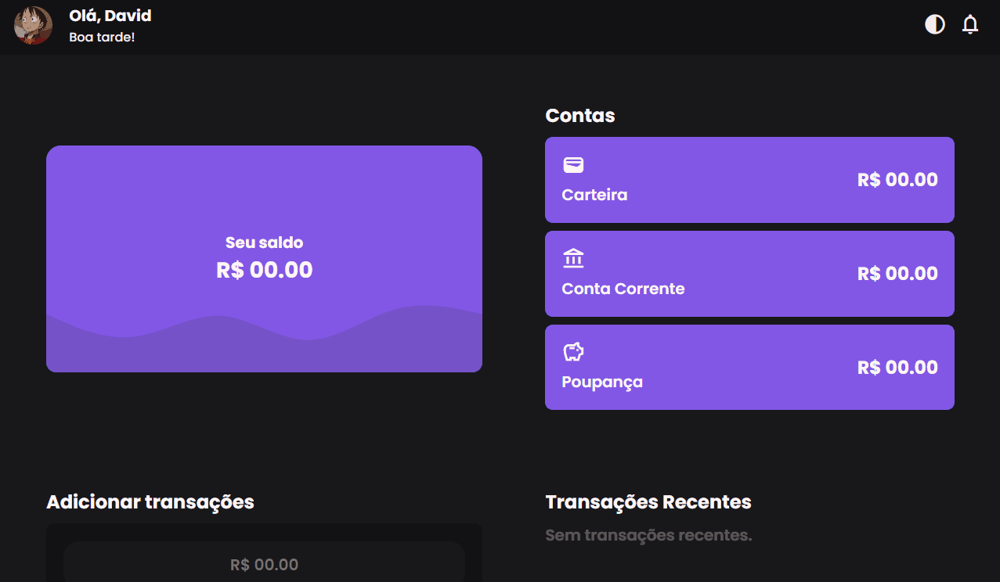

# **Gestor de Finanças**

## :triangular_ruler: **Projeto**
Este projeto se baseia em um app de gestão e registro de gastos e ganhos desenvolvido com tecnologias front-end.

## :link: **Link**
*[Link do projeto.]()*

## :art: **Visual do Projeto**
### *Desktop e Telas Maiores*
<h1 align="center">
    
</h1>

### *Mobile e Telas Menores*
<h1 align="center">
    
</h1>

## :rocket: **Funcionalidades do Projeto**
O projeto conta atualmente com:
* Saudação ao usuário com base na hora do dia (Bom dia!, Boa tarde! e Boa noite!);
* Sistema de registro de ganhos e despesas;
* 3 tipos de contas para as transações (Carteira, Conta Corrente e Poupança);
* Calculo dos saldos de cada conta;
* Calculo do saldo total do usuário;
* Registro com as três últimas transações.

## :construction: **Futuras atualizações**
Funcionalidades que poderão ser incluídas em breve no projeto:
* Tema claro;
* Implementação de mais tipos de transações (Empréstimos, transferência entre contas);
* Sistema de criação de contas próprias além das 3 padrões;
* Personalização do Perfil (Foto e nome);
* Calculadora na área de gestão de gastos.

## :wrench: **Tecnologias**
Tecnologias utilizadas no projeto.
* HTML;
* SCSS;
* CSS;
* JavaScript;
* Visual Studio Code;
* Google Fonts e Material Icons.

---